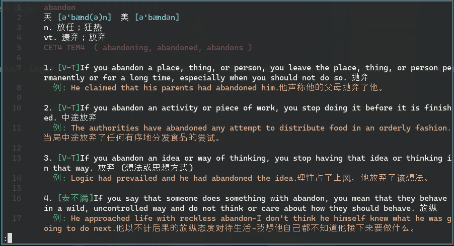

# 无道词典


---

无道词典，是一个简洁优雅的有道词典命令行版本。支持英汉互查的功能，包含释义、词组、例句等有助于学习的内容。

无道词典致力于做最好的命令行词典，随着我们优化排版、显示，增加生词本和补全功能，提供了良好的用户体验，并在不断改进中。

英汉：


汉英:


## 功能特性

1. 基础词典(20w英汉查询 + 10w汉英查询 + 网络词库)
2. 词组查询功能(例如直接输入`wd in order to`)
3. 自动补全功能(按Tab自动补全单词，包含1w个最热的词)
4. 生词本(自动把历史记录存为生词本，`wd -h`查看生词本文件位置)
5. 交互模式(`wd -i`进入，可以连续查词)


## 安装说明

遇到任何问题，或者有任何改善建议请联系作者。 

邮箱: chestnutheng@hotmail.com

issue: <a href="https://github.com/ChestnutHeng/Wudao-dict/issues/new">创建新的 issue</a>

### Linux 环境

1. 安装环境: 需要python3和bs4, lxml(在线搜索用)
    #### Debian/Ubuntu
    ```
    sudo apt-get install python3
    sudo apt-get install python3-pip
    sudo pip3 install bs4
    sudo pip3 install lxml
    ```
    #### OpenSUSE
    ```
    sudo zypper install python3-pip
    sudo pip3 install bs4
    sudo pip3 install lxml
    ```
    #### CentOS
    ```
    sudo yum install python34
    sudo yum install python34-pip
    sudo pip3 install bs4
    sudo pip3 install lxml
    ```
    #### MacOS
    ```
    brew install python3
    sudo easy_install pip
    sudo pip install bs4
    sudo pip install lxml
    brew install bash-completion
    ```

2.  运行
    ```sh
    git clone https://github.com/chestnutheng/wudao-dict
    cd ./wudao-dict/wudao-dict
    sudo bash setup.sh #或者sudo ./setup.sh
    ```

    看到出现`Setup Finished!`表明安装成功。如果发生由于移动安装文件不能使用的情况，只需再次运行该脚本即可。

无法clone的，可以下载 https://github.com/ChestnutHeng/Wudao-dict/archive/master.zip ,然后解压安装使用。

**Note: 注意python的版本，只支持python3**


## 使用说明

运行`wd -h`查看使用说明。


```
$ wd -h
Usage: wd [OPTION]... [WORD]
Youdao is wudao, a powerful dict.
-k, --kill             kill the server process       (退出服务进程)
-h, --help             display this help and exit    (查看帮助)
-s, --short            do or dont show sentences     (简明/完整模式)
-i, --inter            interaction mode              (交互模式)
-n, --note             save/not save to notebook     (保存/不保存到生词本)
-v, --version          version info                  (版本信息)
生词本文件: ... some path .../notebook.txt
查询次数: ... some path .../usr_word.json
```

查词时可以直接使用`wd 词语`查汉英词典，或`wd word`查英汉词典(可以自动检测)。

## 配置

支持通过环境变量配置Python环境地址和PAGER程序。将以下内容加入shell配置文件（`.bashrc`、`.zshrc`等），或在运行时指定（例如：`WD_PAGER=bat wd word` ）

```bash
# 系统存在多个Python环境时，建议指定专用python地址，例如`/usr/bin/python3`，避免切换环境时需重新安装bs4等依赖。不指定此变量则直接执行当前环境的`python3`
export WD_PYTHON_PATH=/your/env/path/python
# 指定pager命令。输出结果较长时可以使用翻页程序（例如`less`、`more`、`bat`等）翻页滚动。默认为空
export WD_PAGER_COMMAND='less -F'  # -F参数设置less只有一页时不进入翻页模式
```

如图为指定`export WD_PAGER_COMMAND=bat`时的效果，可上下滚动查看内容：

<!-- #  -->


## 小贴士

0. ./wd_monofile 是本词典的在线查询的单文件版本, 可以复制到`/usr/bin`下直接使用.(需要安装bs4)
1. 如果您不想看到例句, 请使用`wd -s`关闭。可以再次运行该命令打开。
2. 有的用户反馈字体颜色看不清的问题, 你可以找到./wudao-dict/wudao-dict/src/CommandDraw.py, 可以看到释义,读音等采用的颜色, 直接修改即可.
3. 查询词组直接键入类似`wd take off`即可.

## Release Notes

#### Ver 1.0 (Oct 10, 2016)

* 提供了基础的英汉互查的功能
* 提供了在线查询的功能，并且查过后会缓存

#### Ver 1.1 (Dec 1, 2016)

* 提供了可以单独运行的单文件版本`wd_monofile`

#### Ver 1.2 (Nov 22, 2017)

* 在线查询修复了不显示被查词的bug

#### Ver 2.0 (Dec 3, 2018)

* 修复了文件夹过大的问题，由263M缩小到80M左右。<a href="https://github.com/ChestnutHeng/Wudao-dict/issues/1"> issue #1: 文件夹大小</a>
* 添加了更多的常用词和单复数形式
* 取消了网络搜索功能，没有在本地找到时会自动进行网络搜索
* 添加了bash终端的tab补全的支持，对常用的1w词进行tab补全 <a href="https://github.com/ChestnutHeng/Wudao-dict/issues/15">issue #15: 模糊查询的支持</a>
* 添加了生词本功能，自动把查过的词和释义添加到生词本文件中
* 优化了排版，同一单词不再截断换行了 #该功能因为转移字符的问题搁置 <a href="https://github.com/ChestnutHeng/Wudao-dict/issues/16">issue #16:避免在单词内换行</a>

#### Ver 2.1 (Nov 27, 2019, lastest)
* 添加了交互模式，输入`wd -i`进入可以连续查词。<a href="https://github.com/ChestnutHeng/Wudao-dict/issues/49"> issue #49: 交互模式 wd -i</a>
* `wd -s`可以保存啦！每次使用这个命令都会切换整句/简略模式。 <a href="https://github.com/ChestnutHeng/Wudao-dict/issues/18"> issue #18: 建议默认只看释义</a>
* 生词本添加了音标。<a href="https://github.com/ChestnutHeng/Wudao-dict/issues/22"> issue #22: 能在生词本加入音标吗 </a>
* 添加了版本号。<a href="https://github.com/ChestnutHeng/Wudao-dict/issues/25">issue #25: 建议加个-v，否则不知道自己当前用的是哪个版本 </a>
* 指定生词本的想法也被集合在了交互模式中。用`wd -i`进入查看！
* 支持检测生词本重复词条，最近查过的100条不会被记录。<a href="https://github.com/ChestnutHeng/Wudao-dict/issues/40">issue #40: 应该支持检测生词本重复词条的特性 #40 </a>
* 词条上报升级为HTTPS链接，更好的保密性和安全性。<a href="https://github.com/ChestnutHeng/Wudao-dict/issues/46">issue #46: 安全问题！ </a>
